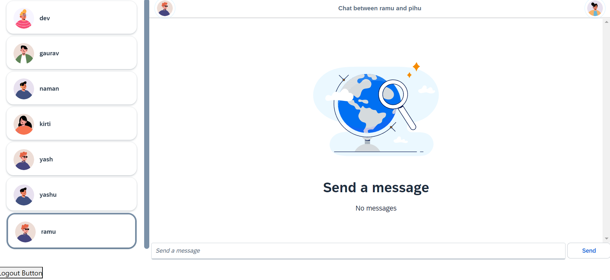

# Scalable Real-Time Chat Application

## Overview
This project aims to build a full-stack, scalable chat application capable of handling real-time communication for a large number of users. The system is designed for efficiency, security, and scalability, making it suitable for production-level use.

Note: I have made some assumptions and applied my understanding of system design to build this project. This project is currently under process and continues to evolve with improvements in architecture and features.

## Images

## Features
* Real-time messaging: 
    * Instant communication between users with support for offline users, enabling message delivery once they reconnect.
* Horizontal scalability: Utilizes Redis Pub/Sub to allow for communication between clients across multiple servers.
* Optimized database writes: 
    *  Message queue system batches and writes messages to the database at regular intervals, reducing the number of operations and enhancing performance.
Secure authentication: Custom hooks for user authentication via JWT tokens for secure signup and login processes.
* Performance boost with read replicas: 
    *  Efficient separation of read and write operations using a read replica database for optimal scalability and performance.
* Cloud deployment: 
    *  Leveraging AWS Elastic Beanstalk for handling dynamic traffic loads, with built-in auto-scaling and load balancing.

## Project Structure
* Real-Time Messaging

    * WebSockets: Implemented WebSockets for bidirectional communication between the client and server, allowing instant messaging. Even if a user is offline, messages are queued and delivered once they reconnect.
* Horizontal Scalability with Redis

    * Redis Pub/Sub: Used Redis Pub/Sub to enable horizontal scaling of the application, allowing it to handle a large number of users by distributing the communication load across multiple servers.

* Authentication

    * JWT Token Authentication: Implemented custom hooks to securely authenticate users via JSON Web Tokens (JWT). Users can sign up and log in, and the system ensures that only authenticated users can send or receive messages.

* Message Queue System

    * Queue for Database Writes: To reduce the number of write operations and ensure that the database can handle heavy traffic, a message queue system was introduced. Messages are queued and saved in bulk to the database at regular intervals, reducing the strain on the system.
* Read-Write Optimization

    * Read Replica Database: Implemented a read replica to optimize database performance. By separating read operations from write operations, the application can handle high volumes of queries without affecting message storage performance.
* Cloud Deployment on AWS Elastic Beanstalk

    * Elastic Beanstalk: The application is deployed on AWS Elastic Beanstalk, providing auto-scaling and load balancing to handle varying traffic loads. This ensures that the application can scale up or down based on demand..

## Technologies Used
* WebSockets for real-time communication.
* Redis Pub/Sub for horizontal scaling.
* JWT tokens for secure authentication.
* Message Queue for optimized database writes.
* Read Replica Database to improve performance.
* AWS Elastic Beanstalk for deployment with auto-scaling and load balancing.
## Getting Started
### Prerequisites
* Node.js installed
* MongoDB Atlas for database hosting
* Redis for Pub/Sub
* AWS account for deploying to Elastic Beanstalk

## Summary:
This project demonstrates a full-stack, scalable chat application designed to handle real-time communication for a large number of users. While still under development, the system incorporates key design principles aimed at ensuring efficiency, security, and scalability, making it suitable for production-level use.
